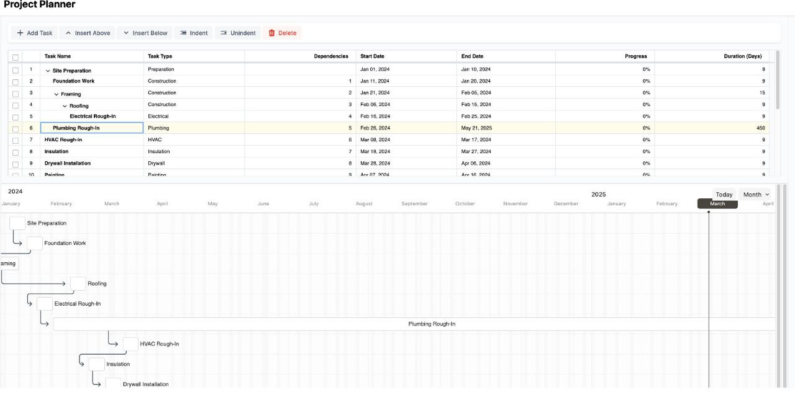

# Krama 

Krama is a project planning tool inspired by robicch/jQueryGantt aiming to provide opensource planning tool based on Frappe's Data Table and Gantt. 

The work Krama (क्रम) is a sanskrit word for system planning/task sequencing.


## Features

- **Task Management**: Add, edit, delete, indent, and unindent tasks.
- **Gantt Chart**: Visualize project timelines with a Gantt chart.
- **Dependencies**: Manage task dependencies.
- **Progress Tracking**: Track the progress of tasks.
- **Responsive Design**: The Gantt chart is responsive and adjusts to different screen sizes.

## Components

### FrappeProjectPlanner.vue

This component provides a table interface for managing tasks. It uses the `frappe-datatable` library for displaying and editing tasks.

#### Key Features

- Add, edit, delete tasks.
- Indent and unindent tasks to create a hierarchy.
- Manage task dependencies.
- Track task progress.
- Calculate task duration based on start and end dates.

### GanttChart.vue

This component visualizes tasks in a Gantt chart using the `frappe-gantt` library.

#### Key Features

- Display tasks in a Gantt chart.
- Automatically adjust the chart's date range based on tasks.
- Responsive design to handle different screen sizes.

## Project Setup

### Install Dependencies

```bash
npm install
```

### Compiles and Hot-reloads for Development

```bash
npm run dev
```

### Compiles and Minifies for Production

```bash
npm run build
```

## Usage

1. **Add a Task**: Click the "Add Task" button in the toolbar.
2. **Edit a Task**: Click on a cell in the table to edit its content.
3. **Delete a Task**: Select a task and click the "Delete" button in the toolbar.
4. **Indent/Unindent a Task**: Select a task and click the "Indent" or "Unindent" button in the toolbar.
5. **View Gantt Chart**: The Gantt chart will automatically update based on the tasks in the table.

## Contributing

Contributions are welcome! Please open an issue or submit a pull request.

## License

This project is licensed under the GPL License.